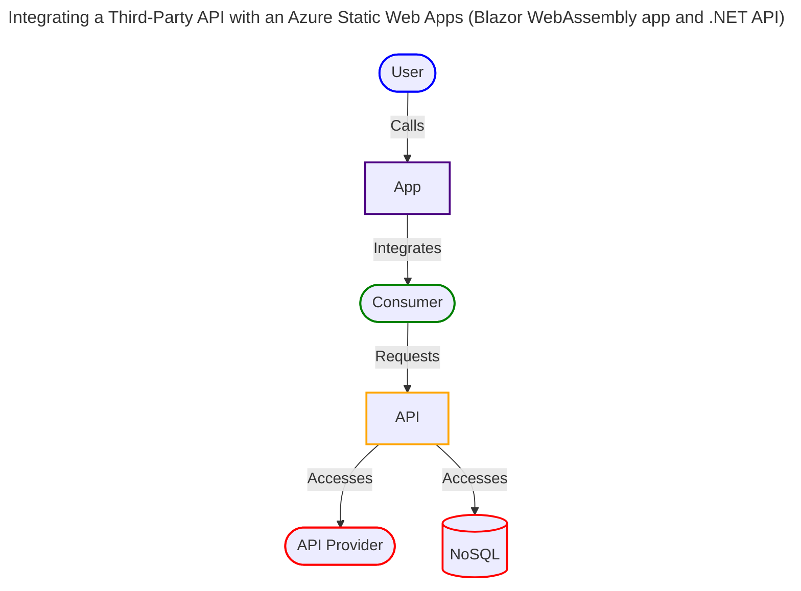

# 📊 StockApp

**StockApp** is a full-stack .NET solution that demonstrates how to build and deploy scalable, secure, and modern web applications using **Azure Static Web Apps**, **Blazor WebAssembly**, and **Azure Functions (Isolated Worker)**. It integrates GitHub authentication, CI/CD, and Cosmos DB to showcase a clean, layered architecture for cloud-native development.

---

## 🚀 Overview

This project was built using:

- 🧰 **Visual Studio 2022**
- 🧠 **.NET 8**
- 🎨 **Blazor WebAssembly** (Client-side UI)
- ⚙️ **Azure Functions (Isolated Worker)** (Serverless backend)
- 🗄️ **Azure Cosmos DB (NoSQL)** (Cloud-native data storage)
- 🔐 **GitHub Authentication**
- 🧪 **Azure Static Web Apps CLI (SWA CLI)**
- 🧱 **Fluent UI Blazor Components**

---

## 📄 Architecture - Summary

The architecture emphasizes scalability, security, and maintainability by leveraging Azure Static Web Apps for hosting, Azure Functions for serverless backend logic, and Azure Cosmos DB for NoSQL data storage. The integration of GitHub authentication ensures secure access, while the use of Blazor WebAssembly enables rich client-side interactions.

---

## 🧱 Architecture - Design Overview
 
The architecture is designed to separate concerns across different layers, ensuring a clean and maintainable codebase. The Presentation Layer, built with Blazor WebAssembly, handles user interactions and UI rendering. The Application Layer, powered by Azure Functions, manages business logic and orchestrates use cases. The Domain Layer encapsulates core models and domain logic, while the Infrastructure Layer integrates external services such as third-party APIs and authentication mechanisms. 

| 🧩 Layer         | 📁 Project Folder(s)                                | 📌 Responsibilities                                      |
|------------------|-----------------------------------------------------|----------------------------------------------------------|
| 🎨&nbsp;Presentation  | `StockApp.Client`, `StockApp.Pwa`                   | UI rendering, client interactions, API exposure          |
| 🧠&nbsp;Application   | `StockApp.Api`                                      | Business logic, use case orchestration                   |
| 🧬&nbsp;Domain        | `StockApp.Shared.Models`, `StockApp.Shared.Enums`   | Core models and domain logic                             |
| 🔌&nbsp;Infrastructure| `StockApp.Api.Services`, `Swa.Auth.Standard`        | External APIs, background tasks, authentication          |

---

## 📐 Architecture - Physical Design

This diagram illustrates the physical architecture of the StockApp solution.


---

## 🏗️ Architecture - Logical Design

This diagram illustrates the logical architecture of the StockApp solution.


---

## 🌐 Azure Static Web Apps Features

This project uses the following ASWA capabilities.

- ✅ Free Web Hosting
- 🔐 GitHub Authentication
- 🔄 GitHub CI/CD Integration
- 🔒 Free SSL Certificates
- 🌍 Custom Domain Support
- 🛡️ Built-in Security
- 🧪 Local Dev with SWA CLI
- 🔌 Integrated API with Azure Functions
 
---

## 📦 Tech Stack Summary

The StockApp solution leverages a variety of technologies to deliver a robust and scalable web application:

- 🧮 **Languages**: HTML (52.6%), C# (38.2%), CSS (6.2%), JavaScript (3.0%)
- 🧱 **Frameworks**: .NET 8, Blazor WebAssembly
- ☁️ **Cloud Services**: Azure Static Web Apps, Azure Functions, Azure Cosmos DB
- 🛠️ **Dev Tools**: Visual Studio 2022, GitHub Actions

---

## 🛠️ Getting Started

To run the StockApp solution locally, follow these steps:

```bash
# Clone the repo
git clone https://github.com/rdw100/StockApp.git

# Install prerequisites
# - .NET 8 SDK
# - Azure Static Web Apps CLI

# Run locally
swa start ./StockApp.Blazor --api ./StockApp.Api
```
---

